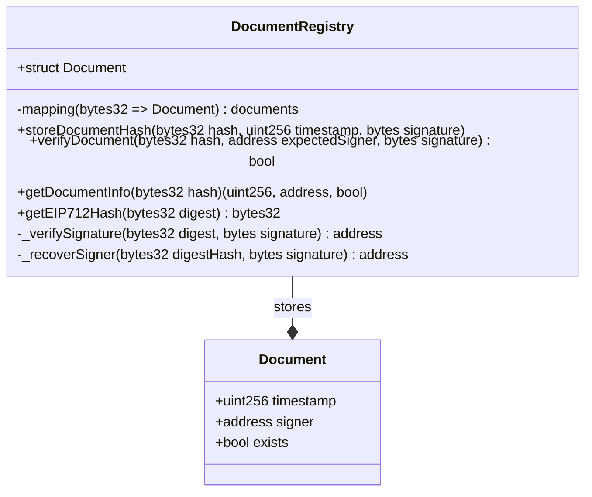

# DocumentSignStorage

Sistema descentralizado para el registro y verificación de integridad de documentos digitales utilizando firmas EIP-712 y almacenamiento en la blockchain (EVM).

El proyecto permite a los usuarios cargar un archivo, generar su hash criptográfico (Keccak-256), firmarlo digitalmente y registrar esa "huella digital" en un Smart Contract para asegurar su existencia y autoría en un momento determinado.

## 🏗️ Estructura del Proyecto

El monorepositorio está dividido en dos partes principales:

-   **/sc**: Smart Contracts desarrollados con **Foundry**.
-   **/web**: Aplicación frontend desarrollada con **Next.js**, **Ethers.js** y **TailwindCSS**.

## 🛠️ Tecnologías y Dependencias

### Smart Contracts (Foundry)
-   **Solidity 0.8.19**: Lenguaje de programación de los contratos.
-   **OpenZeppelin**: Estándares de seguridad y utilidades para EIP-712.
-   **Foundry**: Herramienta de desarrollo (Forge para compilación/tests, Anvil como nodo local).

### Frontend (Next.js)
-   **React 19 & Next.js 16**: Framework principal.
-   **Ethers.js v6**: Interacción con la blockchain y manejo de wallets.
-   **TailwindCSS**: Estilado de la interfaz.
-   **Zod**: Validación de esquemas.
-   **Lucide React / Heroicons**: Iconografía.
-   **Jest & Testing Library**: Suite de pruebas.

## 📊 Diagrama UML de Estructuras

### Smart Contract: DocumentRegistry



## 🚀 Funcionalidades Implementadas

1.  **Generación de Hash Local**: Cálculo del hash Keccak-256 del archivo seleccionado sin subirlo a ningún servidor (privacidad total).
2.  **Firmas EIP-712**: Implementación de firmas estructuradas para que el usuario sepa exactamente qué está firmando.
3.  **Registro On-chain**: Almacenamiento del hash, el timestamp y la dirección del firmante en la blockchain.
4.  **Verificación de Integridad**: Herramienta para validar si un archivo coincide con un registro previo y si la firma es válida.
5.  **Simulación de Wallets (Modo Dev)**: Integración directa con cuentas de Anvil para facilitar el desarrollo local sin necesidad de extensiones externas inicialmente.
6.  **Multi-chain Ready**: Configuración preparada para diferentes redes (aunque optimizada para Anvil en desarrollo).

## 🛠️ Ejecución en Modo Local (Dev)

Para ejecutar el proyecto localmente, sigue estos pasos:

### 1. Requisitos Previos
-   [Foundry](https://book.getfoundry.sh/getting-started/installation) instalado.
-   [Node.js](https://nodejs.org/) (v18+ recomendado) y npm.

### 2. Configurar el Nodo Local (Anvil)
Abre una terminal y ejecuta:
```bash
anvil
```
*Esto iniciará un nodo local en `http://127.0.0.1:8545` con 10 cuentas de prueba.*

### 3. Automatización del Despliegue (Recomendado)
El proyecto incluye un script `deploy.sh` en la raíz que automatiza la compilación, ejecución de tests, despliegue y configuración del frontend:

```bash
chmod +x deploy.sh
./deploy.sh
```

Este script realiza lo siguiente:
1. Compila los contratos inteligentes.
2. Ejecuta las pruebas funcionales.
3. Despliega el contrato `DocumentRegistry` en el nodo Anvil local.
4. Actualiza automáticamente el ABI en el directorio del frontend.
5. Genera el archivo `.env` en la carpeta `web` con la dirección del contrato desplegado.

### 4. Configuración Manual (Opcional)
Si prefieres realizar los pasos de manera individual:

#### A. Desplegar Contratos
```bash
cd sc
# Compilar
forge build
# Desplegar (asegúrate de que anvil esté corriendo)
forge create --rpc-url http://127.0.0.1:8545 --private-key 0xac0974bec39a17e36ba4a6b4d238ff944bacb478cbed5efcae784d7bf4f2ff80 src/DocumentRegistry.sol:DocumentRegistry
```

#### B. Configurar Frontend
```bash
cd web
# Instalar dependencias
npm install
# Configurar dirección del contrato
echo "NEXT_PUBLIC_CONTRACT_ADDRESS=DIRECCION_DE_TU_CONTRATO" > .env.local
```

### 5. Ejecutar la Aplicación Web
```bash
npm run dev
```
La aplicación estará disponible en [http://localhost:3000](http://localhost:3000).

## 🧪 Tests

### Frontend
```bash
cd web
npm test
```

### Smart Contracts
```bash
cd sc
forge test
```

## 📝 Notas de Implementación
- El sistema utiliza el estándar **EIP-712** para la recuperación del firmante, lo que mejora la seguridad y la experiencia de usuario al mostrar datos legibles en la firma.
- El almacenamiento en el contrato es minimalista (mapping de `bytes32`) para optimizar costos de gas.