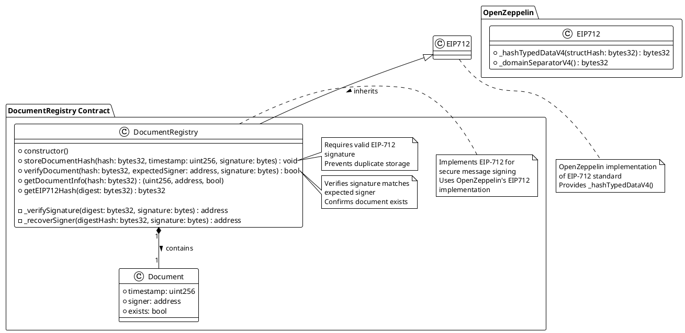

# DocumentRegistry Contract UML Diagram

## Contract Structure

## Description

### Components

1. **DocumentRegistry**: Main contract that manages document storage and verification
2. **Document**: Struct that stores document metadata (timestamp, signer, existence flag)
3. **EIP712**: Inherited contract from OpenZeppelin that provides EIP-712 signature functionality

### Relationships

- The `DocumentRegistry` contract inherits from `EIP712`, gaining access to EIP-712 signing functionality
- The `DocumentRegistry` contains a mapping of document hashes to `Document` structs

### Key Functions

#### Public Functions

- **storeDocumentHash**: Stores a document hash with timestamp and signature
- **verifyDocument**: Verifies a document's authenticity
- **getDocumentInfo**: Retrieves document metadata
- **getEIP712Hash**: Debug function to access EIP-712 hash (for testing)

#### Internal Functions

- **_verifySignature**: Internal function that verifies EIP-712 signatures
- **_recoverSigner**: Recovers the signer address from a signature using ecrecover

### Security Considerations

- All state-changing functions are external
- Signature validation ensures proper length and v value
- Duplicate document prevention
- EIP-712 domain separation prevents signature replay attacks

### Data Flow

1. User calls `storeDocumentHash` with document hash, timestamp, and EIP-712 signature
2. Contract verifies the signature using `_verifySignature`
3. If valid, the document is stored in the mapping
4. Later, users can call `verifyDocument` to check a document's authenticity
5. The `getDocumentInfo` function allows retrieval of document metadata

This UML diagram represents the complete structure and relationships within the DocumentRegistry contract system.